# Mechanical Artisan

The Mechanical Artisan block is the block that does all the work and opens the GUI when clicked. It can only be placed on top of a Power Converter block.

## System Panel

### Table Slot

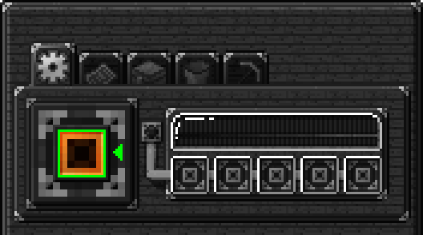

The table slot accepts any AW table and determines which recipes the Mechanical Artisan can use.

### Energy Bar

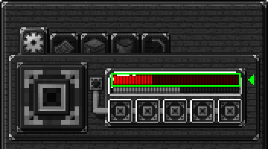

This displays how much energy the machine has. If the machine’s energy is too low, recipes will not craft.

Energy capacity and usage can be increased with upgrades.

### Duration Bar

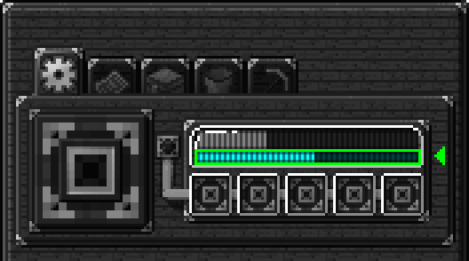

When the Mechanical Artisan has power and a table, this bar will fill up. When the bar is full, the machine will attempt to craft an item.

The speed of this bar can be modified using upgrades.

### Upgrades

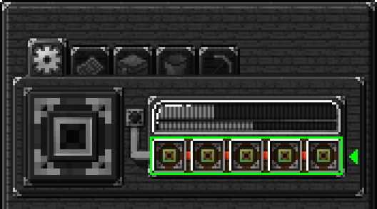

The Mechanical Artisan can accept upgrade items in these slots.

See [upgrades](upgrades.md) for more info.

## Pattern Panel

### Pattern Slots

Patterns created with the Designer’s Table are inserted here to tell the machine which recipes to craft.

### Output Slots

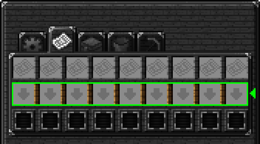

Items output by each recipe above will be placed here. Each slot handles only the output from the recipe above it. These slots will display only one output item at a time, but can hold a large number of distinct output items. Items can be extracted from these slots using any side of any Power Adapter block below the Mechanical Artisan.

### Buttons

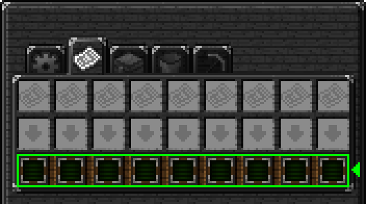

These buttons determine how the output slots behave.

 **Keep**

When in this mode, the output slot will keep its contents and only allow manual extraction via the GUI.

 **Manual**

In this mode, the output slot will allow its contents to be extracted from any attached Power Converter block with hoppers and / or pipes.

 **Inventory**

This mode will attempt to place the output slot's contents into the machine's inventory.

 **Export**

If the machine has an Auto-Export Items Upgrade, this mode will be available. In this mode, the output slot will attempt to place its contents into any available inventory adjacent to a connected Power Converter block.

## Inventory Panel

### Inventory Slots

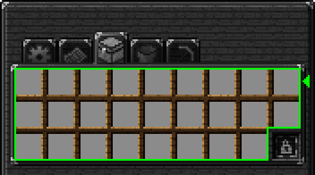

The Mechanical Artisan can hold a total of 26 input items.

### Inventory Lock

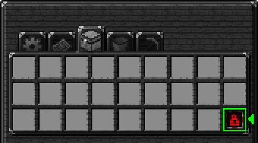

The machine’s inventory can be locked using the button shown above. When the button indicates a red, closed lock, the inventory will remember the items in each slot and will allow only those items to be inserted into the inventory. When the button shows a green, open lock, the inventory will accept any item in any slot. **CTRL + Left Click** will clear a remembered item.

## Fluid Panel

### Bucket Slots

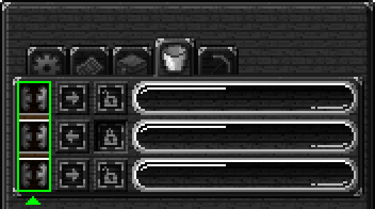

Buckets can be inserted into the slots indicated above to either extract fluid from a tank or insert fluid into a tank.

### Tank Buttons

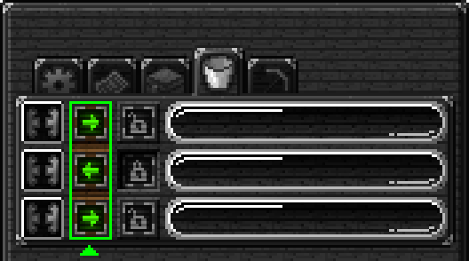

When this button shows an arrow pointing to the right, fluid will flow from a bucket into the tank. When it shows an arrow pointing to the left, fluid will flow from the tank into a bucket. The Auto-Import Fluids Upgrade will only import fluids into tanks with a green arrow.

### Tank Locks

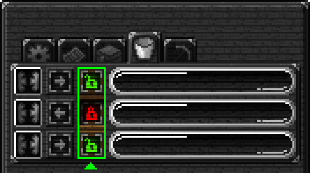

If a tank is locked, indicated by a red, closed lock, the tank will remember which fluid it contains and will only allow the remembered fluid into the tank. If a tank contains no fluid at the time of locking, it will not accept any fluid after being locked. **SHIFT + Left Click** on a tank to clear its remembered fluid.

### Fluid Tanks

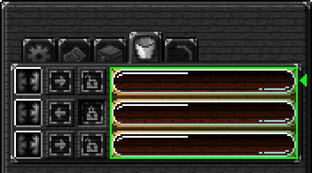

Tanks display the fluid type, amount, and capacity, filling from the left.

## Tool Panel

### Tool Slots

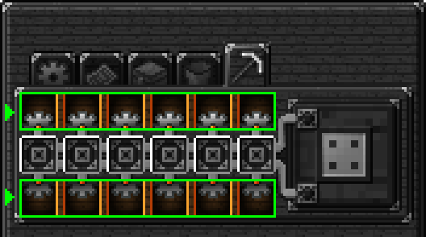

Each Mechanical Artisan will hold up to twelve tools. A tool will only be allowed in a tool slot if the tool is used in an AW recipe.

### Mechanical Toolbox Slot

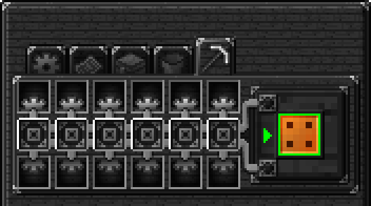

Placing a Mechanical Toolbox in this slot will unlock the repair upgrade slots to the left of the toolbox slot.

### Tool Repair Upgrade Slots

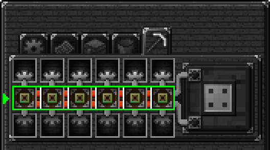

A Tool Repair Upgrade item is required to be slotted in order to repair the tools directly above and below the upgrade. The machine will consume power and materials from its inventory to repair tools.

By default, the machine will consume 1 RF per 1 durability repaired.

!!! note
    A tool will only be repaired if it can accept the entire repair. For example, if the Tool Repair Upgrade is set to repair 25% of a tool's maximum durability, the tool won't be repaired until it drops below 75% of its maximum durability. This is to prevent tools from being repaired after every craft, unnecessarily consuming repair materials.

See [upgrades](upgrades.md) for more info.